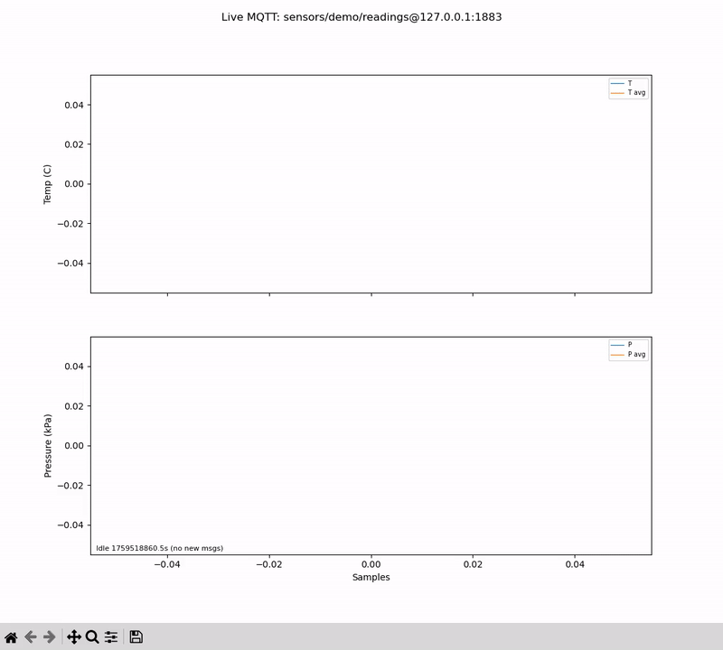

# industrial-sensor-sim


A micro C++17 project simulating temperature and pressure readings, buffering them in a lock-free ring buffer, processing with a moving average filter, and publishing results to an MQTT broker.



## Features
- Simulated temperature & pressure sensors 
- Lock-free SPSC ring buffer 
- Moving average filter 
- MQTT publishing 
 

## Directory Structure
- src/        			(main source)
- include/industrial/   (headers)
- visualizer/       	(assets used for live plot visualization)

## Build
Prerequisites: CMake >= 3.14, C++17 or newer.

Optional for MQTT publishing: Eclipse Paho MQTT C (libpaho-mqtt3c). If not found, the app runs and prints locally but skips MQTT publishing.

```sh
mkdir build
cd build
cmake ..
make -j
```

## Usage

Run the simulator. CLI arguments are optional:

```bash
# ./sensor_sim [window] [count]
#   window: moving average window size (default 8, clamped to 1..256)
#   count : number of samples to produce/consume (default 50)

./build/src/sensor_sim            # window=8, count=50
./build/src/sensor_sim 16 200     # window=16, count=200
```

You’ll see lines like:

```
consumer: T=23.412 C (avg=23.120), P=101.6 (avg=101.7)
```

### MQTT (optional)

The app publishes CSV telemetry when it can connect to an MQTT broker.

- Broker URL and topic can be set via environment variables (override compile-time defaults):
	- `MQTT_BROKER_URL` (default: `tcp://127.0.0.1:1883`)
	- `MQTT_TOPIC` (default: `sensors/demo/readings`)

```bash
# Start a local broker (terminal 1)
mosquitto -v -p 1883

# Subscribe (terminal 2)
mosquitto_sub -h 127.0.0.1 -p 1883 -t sensors/demo/readings -v

# Run the app (terminal 3)
./build/src/sensor_sim 16 100

# Or override via env
MQTT_BROKER_URL=tcp://127.0.0.1:1883 MQTT_TOPIC=sensors/demo/readings ./build/src/sensor_sim 8 50
```

Payload format: CSV `tempC,avgTempC,pressKPa,avgPressKPa` with 3 decimal places.

If the Paho MQTT C library isn’t found or connect fails, the app prints:

```
mqtt: disabled (library missing or connect failed)
```

and continues without publishing.

### Live plotting (optional)

You can visualize the data being received by the MQTT broker with the helper script:

```bash
pip install paho-mqtt matplotlib
python3 visualizer/live_plot.py  # reads env MQTT_BROKER / MQTT_TOPIC if set
```

Shows rolling temperature & pressure (raw + moving average). Adjust `MAX_POINTS` in the script as needed.

## Embedded vs Host notes
This is a PC Host application simulating an embedded solution for the sake of self-training C++. Following are some embedded considerations kept in mind during development of this project:
- SimSensor is a host-side simulator (std::chrono, std::random). On embedded, this would be replaced with hardware drivers/ISRs reading real sensors.
- SPSC ring buffers:
	- `SpscRing<T,N>`: fixed-cap, no-heap; embedded-friendly.
- Time/timestamps: on an embedded platform, HAL/RTOS tick counters or device timers would be used instead of `std::chrono`.
- Logging: an embedded solution would avoid `std::cout`, preferring a lightweight UART logger or disabling logs in firmware builds.

## License
MIT. See LICENSE.
